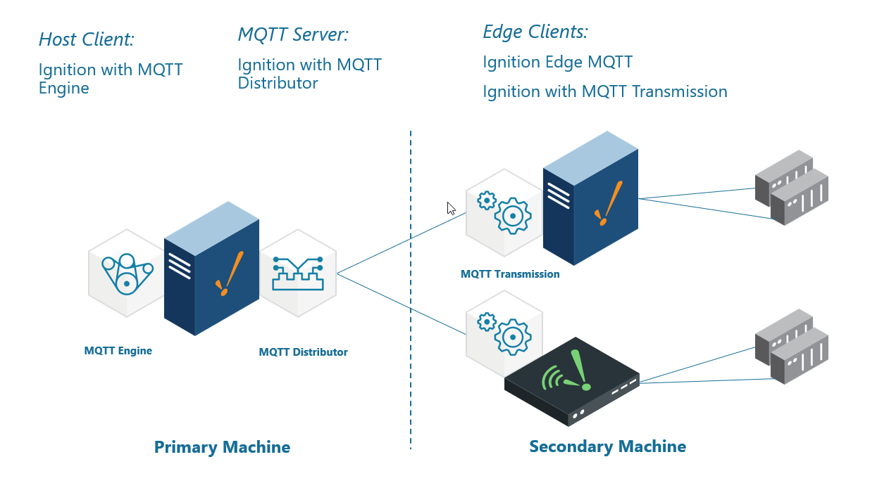
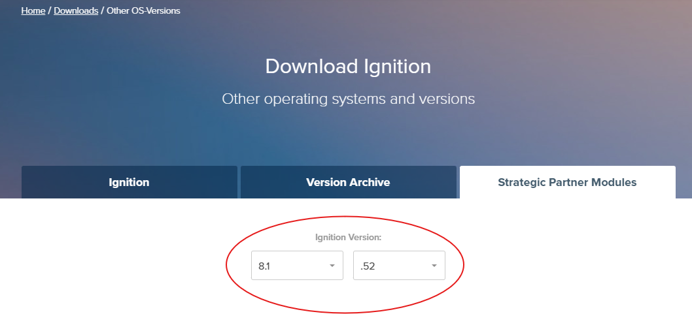
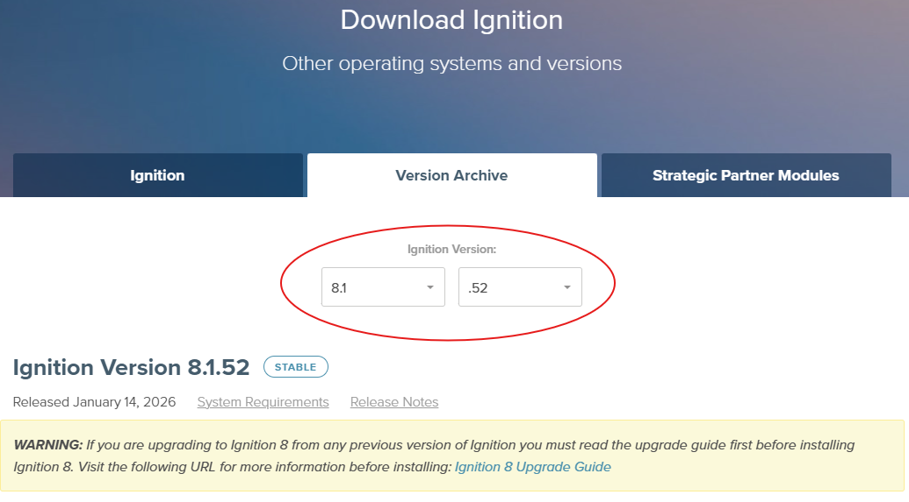
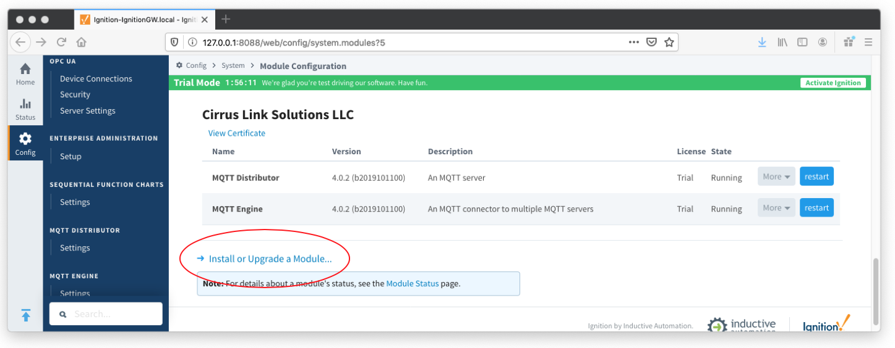
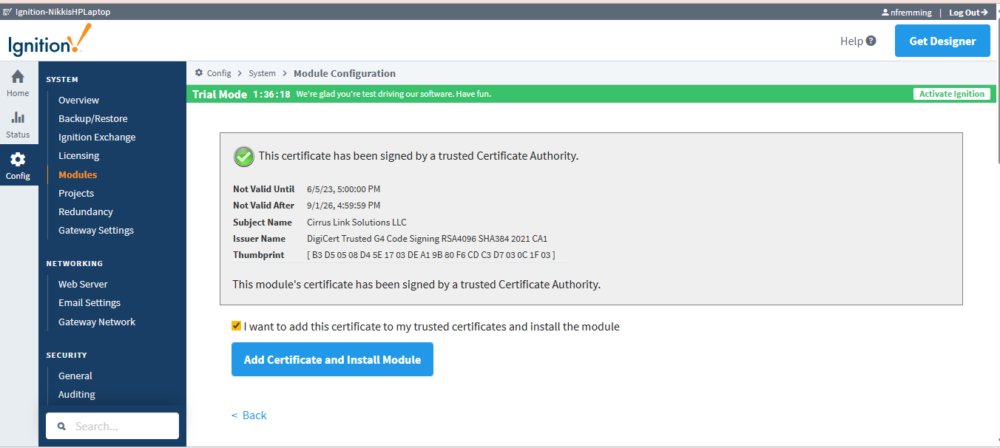
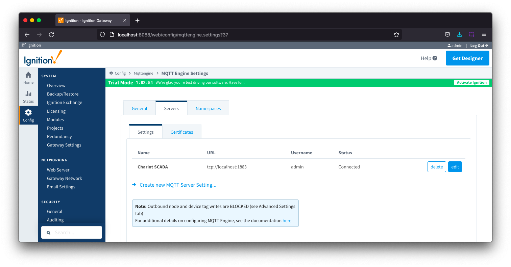
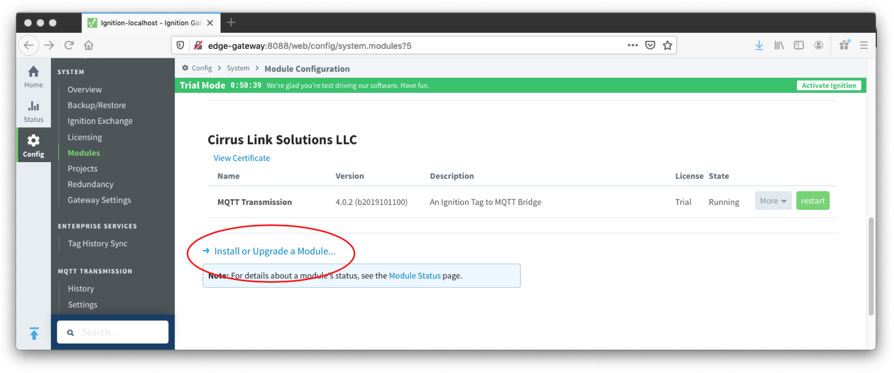
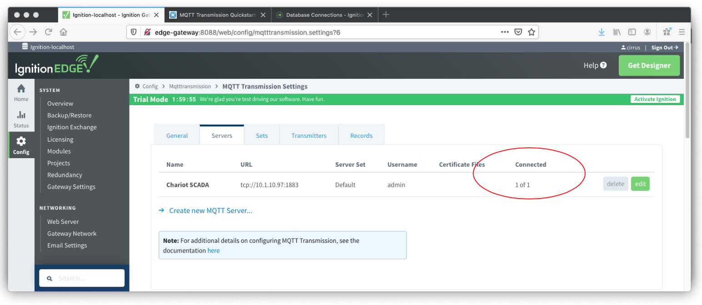
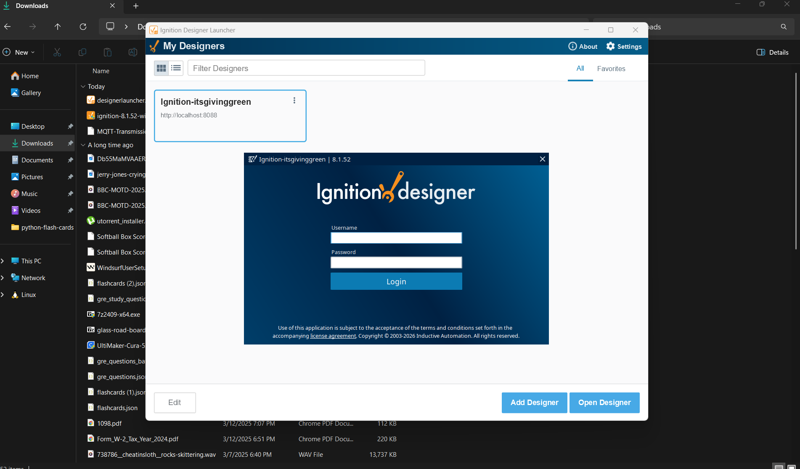
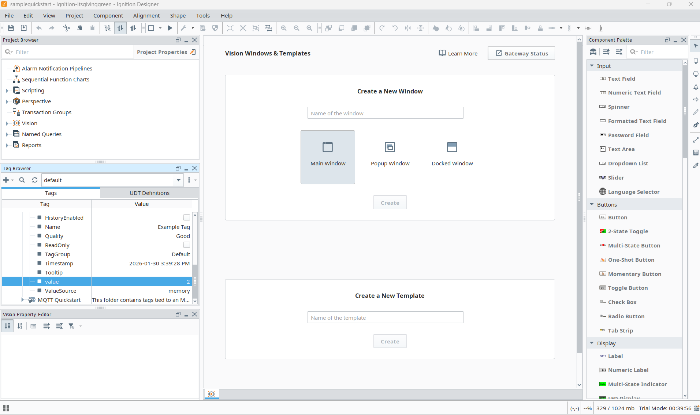

# Getting Started: Two Ignition Architecture
**This tutorial provides step-by-step instructions for installing and configuring a two-gateway Ignition architecture using MQTT.**

## Key Components
**Ignition**: An industrial application platform used to build SCADA and HMI solutions. Ignition can be downloaded and run in trial mode (two hours at a time with unlimited restarts), which allows users to install Cirrus Link MQTT modules and validate system behavior during setup.

**Ignition Edge**: A lightweight version of Ignition designed for edge-of-network devices. Ignition Edge supports unlimited tags, two clients (one local and one remote), and does not include database connectivity.

**MQTT Distributor**: An MQTT server that runs as an Ignition module and acts as the central message broker for MQTT communications in the system.

**MQTT Engine**: An MQTT client module that implements the Sparkplug specification and automatically creates Ignition tag structures for edge nodes, devices, and process variables based on incoming MQTT data.

**MQTT Transmission**: An MQTT client module that implements the Sparkplug specification to publish local Ignition tags (OPC-UA and memory tags) to an MQTT infrastructure.

In this tutorial, MQTT Transmission publishes data from the secondary machine, MQTT Distributor brokers the data, and MQTT Engine consumes and exposes it on the primary machine. See the diagram below for a high level overview.

## Prerequisites
- Two machines to run two Ignition instances (**Ignition + Ignition Edge** or **Ignition + Ignition**)
- **Ignition** can run on a laptop, in the cloud via an AWS EC2 instance, or some other development computer.
- **Ignition Edge** can run on one of many supported embedded edge of network gateways, a laptop or development computer, a Raspberry Pi (load ARMHF version), or also in a cloud service.

## Check Compatibility
Find the latest compatible Cirrus Link Solutions MQTT Modules for Ignition Version **8.1.xx**, as this may not correspond to the most recent version of Ignition. To do this, go to the Strategic Partner Modules tab on the [Ignition Downloads page](https://inductiveautomation.com/downloads/third-party-modules/8.3.3). Use the drop-down menu to find the stable **8.1.xx** version.

* This is the version you will use to download Ignition *and* Cirrus Link MQTT Modules (pictured below the drop-down menu).

## Configure the Primary Machine
1. From the [Ignition Version Archive](https://inductiveautomation.com/downloads/archive), select and download the appropriate Ignition Installer version for either Windows, Linux or MacOS.

2. Follow Inductive Automation’s guide to [install and start Ignition](https://www.docs.inductiveautomation.com/docs/8.1/getting-started/installing-and-upgrading).
> *Note: You will use these credentials again in the next steps, so keep them readily available.*
3. Once Ignition is successfully downloaded and started, go to the Strategic Partner Modules tab on the [Ignition Downloads page](https://inductiveautomation.com/downloads/third-party-modules/8.3.3). Again, use the drop-down menu to find the appropriate **8.1.xx** version(s).
4. Download the **MQTT Distributor Module** and **MQTT Engine Module** under 'Cirrus Link Solutions MQTT Modules for Ignition'.

> ***Note:*** *Ensure that ports 1883 and 8883 are accessible on the primary machine. Refer to your operating system’s firewall documentation for instructions on allowing inbound TCP connections.*

## Configure the Secondary Machine
1. Repeat steps 1 through 3 from configuring the primary machine, on the secondary machine.
> *Note: You will use the previously created credentials here, so have them readily available.*
2. Download the **MQTT Transmission Module** under ‘Cirrus Link Solutions MQTT Modules for Ignition’.

## Configure the Ignition Gateway on Both Machines
### Primary Machine

1. In the Ignition left hand side bar, navigate to **Config** → **SYSTEM** → **Modules**. Scroll to the bottom of the page and click on the link **Install or Upgrade a Module…**

2. When prompted, select the MQTT Distributor module from the file browser and select Install. Accept the license agreement and certification and install the module. Repeat for the MQTT Engine module.

3. When complete, the Ignition Gateway will show the current state of the installed modules (pictured above under the column 'Running').

- By default, MQTT Engine is already configured to point to an MQTT Server at tcp://localhost:1883, which means it will automatically connect to the MQTT Distributor installed with it. No additional configuration is required.

4. To verify the connection status, navigate to the **Config** tab → **MQTT ENGINE** → **Settings** → **Servers** tab. Confirm that the Chariot SCADA Status shows ‘Connected’.

### Secondary Machine
1. In the Ignition left hand side bar, navigate to **Config** → **SYSTEM** → **Modules**. Scroll to the bottom of the page and click on the link **Install or Upgrade a Module…**

2. When prompted, select the **MQTT Transmission** module from the file browser and select Install. Accept the license agreement and certification and install the module.

When complete, the Ignition Gateway will show the current state of the installed module:

3. MQTT Transmission needs to be configured to point to the MQTT Distribution server in order to publish data into the MQTT Engine. To do this, navigate to: **Config** → **MQTT TRANSMISSION** → **Settings** → **Servers** tab. 

4. Edit the MQTT Server named Chariot SCADA to modify the URL to point to the Primary machine’s Ignition Gateway IP Address.

> ***Note:*** *To find the IP address of the primary machine, use the network settings for your operating system or run `ipconfig` (Windows) or `ifconfig` (Linux/macOS).*

- Example: If your IP Address is 10.1.10.97 on your Primary machine, then set the URL to **tcp://10.1.10.97:1883** and **Save Changes**.

- Once configured, MQTT Transmission will automatically connect, and you can confirm by checking that the ‘Connected’ status on the Servers tab shows ‘1 of 1’.

> Validation check: ie. how is the user doing at this point? How can we provide answers for pain points in advance?

## Launch Designer on Both Machines
#### At this point, you are ready to edit the default tag created during the MQTT Transmission installation so that data can be published and observed. 
You will complete the following steps 1-6 on both machines:
1. From the Ignition Gateway web interface, select **Get Designer** and follow the instructions to download, install, and launch **Designer Launcher.**

2. Once Ignition Designer Launcher has launched, navigate to **Settings** in the top right hand corner. 
3. Select **Add Designer**.
4. Once a Designer is added (example pictured below: **Ignition-itsgivinggreen** is the Designer), log in using the username and password previously created in Ignition.

> Note: if you enabled the Quick Start option when starting Ignition, a samplequickstart project will have been created and you will need to open that project. 

5. In the Tag Browser section on the left, select **default** from the drop-down menu.
6. Expand the Edge Nodes folder tree until you have exposed the **PLC 1** folder with the **Example Tag**.

### Test Your Connection
1. On your Secondary machine, where you see the Value as 1, change it to 2.
2. On your Primary machine, verify in the same folder tree that the value has changed from 1 to 2.

> The Ignition Designer tool is not by default in Read/Write mode, so your first attempt to write a new value to this Example Tag will ask you to select either Cancel | Enable Read/Write Mode | Write Once.  Select Write Once or Read/Write to allow Tag value changes.

At this point you have a fully functional system that can be expanded or modified as required.  Below are some additional activities you may want to try on your own.

## Extra Activities
- Allow outbound tag writes. 
- Video 9: Allow Outbound Tag Writes. Disable MQTT Transmission to see the tags go stale in MQTT Engine. Set the 'Primary Host ID'. This is a setting that is highly recommended and should be set on both MQTT Engine and any MQTT Transmission instances that are reporting in as well. 
- Video 10: Primary Host ID Setting Modify the tags folder to add additional memory tags Creating Tags in Ignition and force an update to the Ignition Gateway Using the MQTT Transmission Refresh Mechanism
TLS enable the MQTT Distributor module and disable port 1883. 
- Video 11: How to Set Up Transport Layer Security 
Set up Store-and-Forward in MQTT Transmission to show data being saved when the connection goes down. 
- Video 12: Set Up Store-and-Forward System
